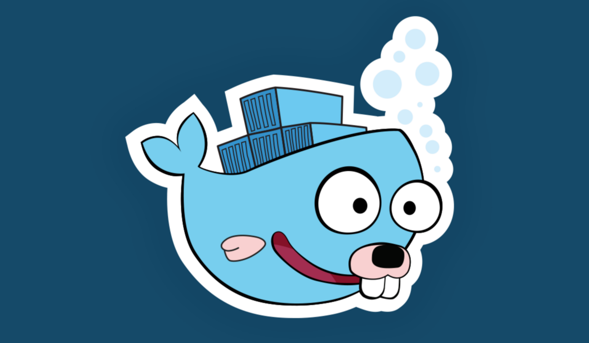

# Containers from scratch



Writing a container in a few lines of Go code, as seen at
[DockerCon 2017](https://www.youtube.com/watch?v=MHv6cWjvQjM&t=1316s) and on
[O'Reilly Safari](https://www.safaribooksonline.com/library/view/how-to-containerize/9781491982310/).

Note that the Go code uses some syscall definitions that are only available when building with `GOOS=linux`.

## Usage

Create a `chroot` environment:
```
podman run -d --rm --name alpine_3 docker.io/library/alpine:3.14 sleep 1000
podman export alpine_3 -o /tmp/alpine_3.tar
podman stop alpine_3
mkdir alpinefs
tar xf /tmp/alpine_3.tar -C alpine
```
Now run the Go code:
```
go build -o container
./container run /bin/sh
```
